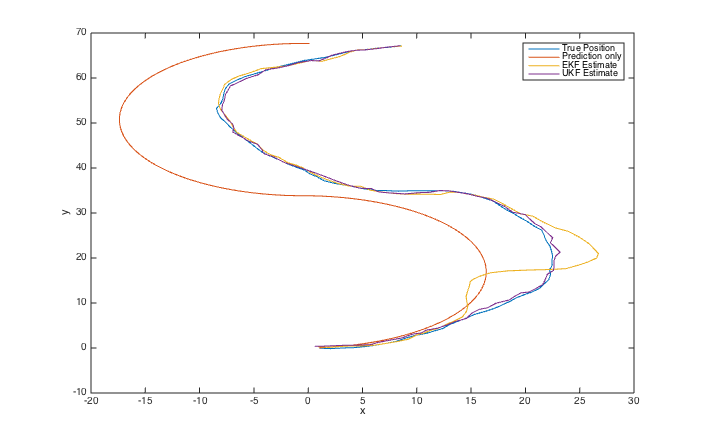
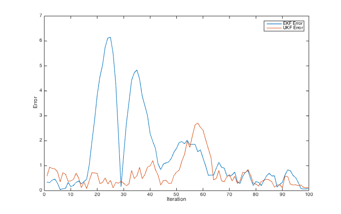

# Kalman Filter Example: 3DOF Planar Robot #1

This example illustrates the use of the Kalman filter library for a simple planar 3DOF robot.

## State
The robot state is given by a 3-vector containing the elements

* _x_: The x-position in the plane
* _y_: The y-position in the plane
* _theta_: The orientation (heading) relative to x-axis

## System Model
The system model defining the evolution of the system state over time is fairly straight forward and is defined in `SystemModel.hpp` along with the control vector.
The system takes a velocity as well as a change in direction as control input. The robot then moves along the vector defined by the orientation plus the change in orientation.

## Measurement Models
Measurements of the system state are taken by two sensors: An orientation sensor (such as a compass) measuring the absolute heading as well as a position-sensor.
However, the position cannot be measured directly, but only the euclidean distance to two landmarks (with known position) can be measured.
This makes estimation of the true position quite challenging since the measurement and state are related by a highly non-linear equation.

The models and measurement vectors are defined in `OrientationMeasurementModel.hpp` and `PositionMeasurementModel.hpp` respectively.

## Results
### Estimated Trajectory

### Euclidean distance error in each time-step

